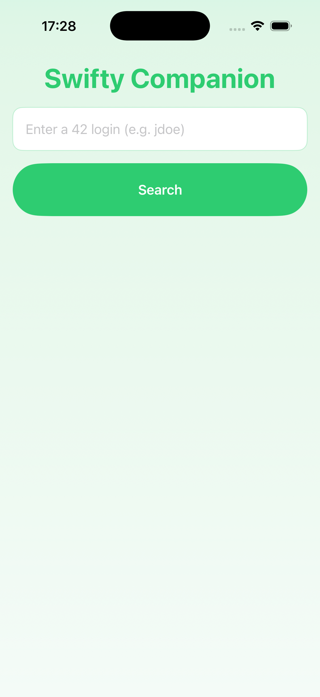
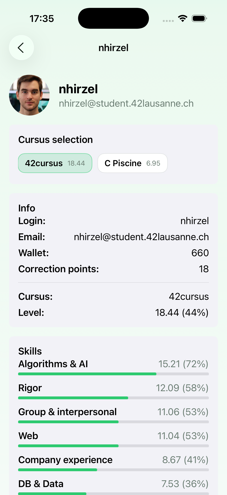
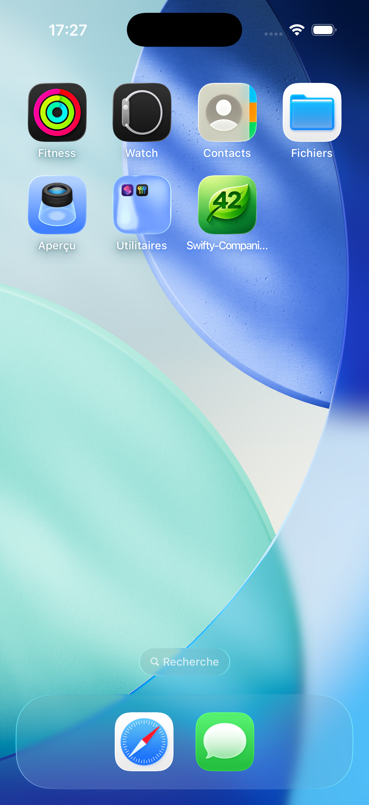
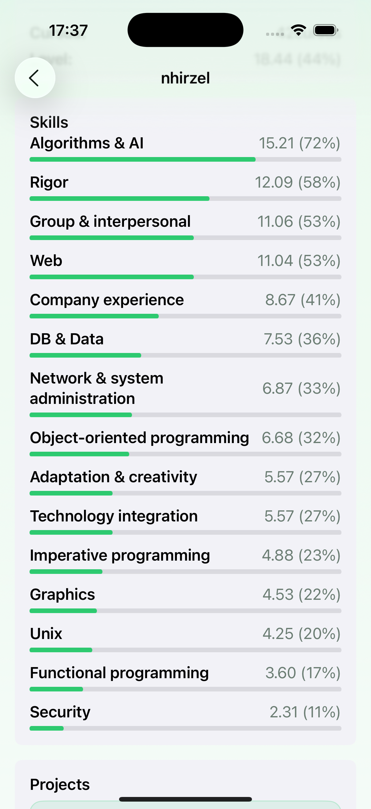
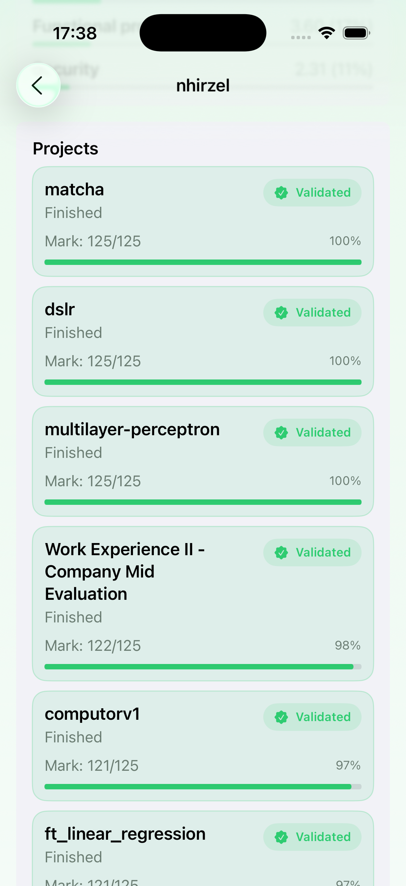
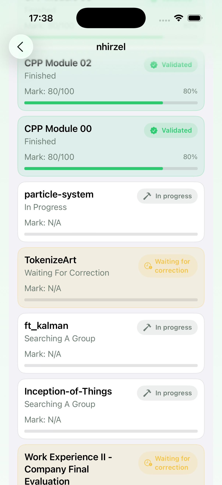
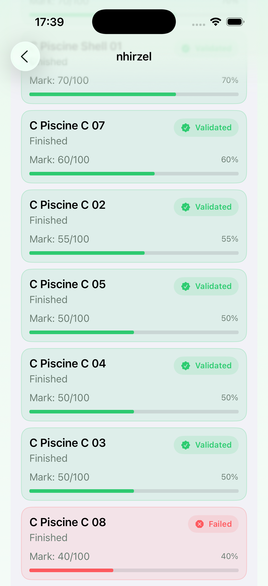

# Swifty Companion

Swifty Companion est une application iOS développée en **Swift** avec **SwiftUI**.

Le but du projet est de permettre à l’utilisateur de rechercher un profil étudiant de l’école 42 à partir de son login, puis d’afficher les informations principales récupérées depuis l’API officielle de l’Intra 42.

L’application gère l’authentification OAuth avec l’API 42, récupère un token d’accès, le stocke temporairement dans le **Keychain iOS**, puis l’utilise pour effectuer les requêtes vers l’API.

---

## Sommaire

- [Documentation technique](#documentation-technique)
- [Présentation du projet](#présentation-du-projet)
- [Technologies utilisées](#technologies-utilisées)
- [Gestion de l’authentification](#gestion-de-lauthentification)
- [Gestion des secrets](#gestion-des-secrets)
- [Avertissement important sur la sécurité](#avertissement-important-sur-la-sécurité)
- [Installation](#installation)
- [Configuration OAuth 42](#configuration-oauth-42)
- [Aperçu de l’application](#aperçu-de-lapplication)
- [Auteur](#auteur)

---

## Documentation technique

Les détails techniques du projet sont disponibles ici :

[Voir la documentation technique](docs/TECHNICAL_DETAILS.md)

---

## Présentation du projet

**Swifty Companion** est un projet mobile iOS réalisé dans le cadre du cursus 42.

L’application permet de rechercher un utilisateur de l’Intra 42 grâce à son login. Une fois le profil trouvé, elle affiche plusieurs informations liées à cet utilisateur :

- login
- email
- wallet
- correction points
- cursus disponibles
- niveau dans le cursus sélectionné
- compétences
- projets
- notes
- statut des projets
- photo de profil

L’interface est construite avec **SwiftUI** et utilise une navigation simple entre une page de recherche et une page de profil.

---

## Technologies utilisées

- Swift
- SwiftUI
- Foundation
- Security
- AuthenticationServices
- UIKit
- URLSession
- Keychain iOS
- OAuth 2.0
- API 42

---

## Gestion de l’authentification

L’authentification suit ce fonctionnement :

1. L’utilisateur recherche un login.
2. `APIClient` demande un token valide à `TokenManager`.
3. `TokenManager` vérifie si un token existe dans le Keychain.
4. Si le token est encore valide, il est réutilisé.
5. Si le token est expiré ou absent :
  - l’application tente d’utiliser le refresh token ;
  - si ce n’est pas possible, elle lance le flow OAuth.
6. L’utilisateur se connecte via l’Intra 42.
7. L’application reçoit un code OAuth.
8. Ce code est échangé contre un access token.
9. Le token est sauvegardé dans le Keychain.
10. La requête vers l’API 42 est effectuée.

---

## Gestion des secrets

Les secrets OAuth sont référencés dans `Info.plist` comme ceci :

```text
<key>INTRA_CLIENT_ID</key>
<string>$(INTRA_CLIENT_ID)</string>

<key>INTRA_CLIENT_SECRET</key>
<string>$(INTRA_CLIENT_SECRET)</string>

<key>INTRA_REDIRECT_URI</key>
<string>$(INTRA_REDIRECT_URI)</string>
```

Ces valeurs peuvent être définies dans un fichier local de configuration Xcode, par exemple `Secrets.xcconfig`.

Exemple :

```text
INTRA_CLIENT_ID = your_client_id
INTRA_CLIENT_SECRET = your_client_secret
INTRA_REDIRECT_URI = swifty-companion://callback
```

Il est important de ne pas versionner ce fichier si de vrais secrets sont utilisés.

Ajouter dans `.gitignore` :

```text
Secrets.xcconfig
```

---

## Avertissement important sur la sécurité

Dans ce projet, les secrets OAuth comme le `client_id` et le `client_secret` sont utilisés directement côté application iOS.

Même si le token est stocké dans le **Keychain**, il faut bien comprendre qu’une application mobile ne peut jamais protéger totalement un secret embarqué dans le binaire.

Le Keychain est adapté pour stocker des données sensibles côté utilisateur, comme :

- access token
- refresh token
- date d’expiration

Cependant, il ne rend pas un `client_secret` réellement secret si celui-ci est inclus dans l’application.

**Pourquoi cette approche a été utilisée ?**

Ce projet a été réalisé dans un contexte scolaire.

Le sujet demandait une application iOS capable d’utiliser l’API 42, mais ne demandait pas de développer un backend dédié.

Dans une application destinée à la production, il serait préférable d’utiliser un backend pour :

- stocker le `client_secret` côté serveur
- gérer l’échange OAuth côté backend
- éviter d’exposer les secrets dans l’application mobile
- contrôler plus finement les tokens
- améliorer la sécurité globale

Dans le cadre de ce projet école, et afin de respecter le temps disponible ainsi que le périmètre demandé, les secrets sont donc utilisés côté application.

Cette solution est acceptable pour un projet pédagogique, mais ne doit pas être considérée comme une architecture de production.

---

## Installation

### Prérequis

- macOS
- Xcode
- un compte développeur Apple ou un simulateur iOS
- une application OAuth créée sur l’Intra 42
- Swift compatible avec le projet
- iOS target compatible avec SwiftUI et `ASWebAuthenticationSession`

---

### Étapes
1. Cloner le projet :
```text
git clone <url-du-repository>
cd SwiftyCompanion
```

2. Ouvrir le projet dans Xcode :
```text
open SwiftyCompanion.xcodeproj
```
ou, si le projet utilise un workspace :
```text
open SwiftyCompanion.xcworkspace
```

3. Créer un fichier local `Secrets.xcconfig`.
4. Ajouter les valeurs OAuth :
```text
INTRA_CLIENT_ID = your_client_id
INTRA_CLIENT_SECRET = your_client_secret
INTRA_REDIRECT_URI = swifty-companion://callback
```
5. Vérifier que `Info.plist` lit bien ces valeurs.
6. Configurer le scheme d’URL dans Xcode si nécessaire.
7. Lancer l’application sur simulateur ou appareil physique.

---

## Configuration OAuth 42

Pour que l’authentification fonctionne, il faut créer une application sur l’Intra 42.

La configuration doit contenir une URI de redirection correspondant à celle utilisée dans le projet.

Exemple :
```text
swifty-companion://callback
```

Dans le code, le scheme est automatiquement extrait depuis la redirect URI avec `URLComponents`.

Ce scheme est ensuite utilisé par `ASWebAuthenticationSession` pour intercepter le retour OAuth.

---

## Aperçu de l’application

### Écran de recherche



Cet écran permet de saisir un login 42 et de lancer la recherche.

---

### Écran de profil



Cet écran affiche les informations principales de l’utilisateur récupéré depuis l’API 42.

---

### Onglet de l'application



L’application possède une icône personnalisée, créée spécialement pour le projet.  
Cette icône permet d’identifier rapidement Swifty Companion sur l’écran d’accueil iOS et donne une apparence plus propre et plus professionnelle à l’application.

---

### Compétences



Chaque compétence est affichée avec son niveau et une barre de progression.

---

### Projets





Les projets sont affichés sous forme de cartes avec leur statut et leur note.

---

## Auteur

Projet réalisé par :

**[Nicolas Hirzel](https://github.com/Np93)**

Dans le cadre du cursus 42.

---

## [Licence](https://github.com/Np93/Swifty_Companion/blob/main/LICENSE)

Ce projet est réalisé dans un cadre scolaire.

Il n’est pas destiné à être utilisé tel quel en production, notamment à cause de la gestion des secrets OAuth directement côté application mobile.